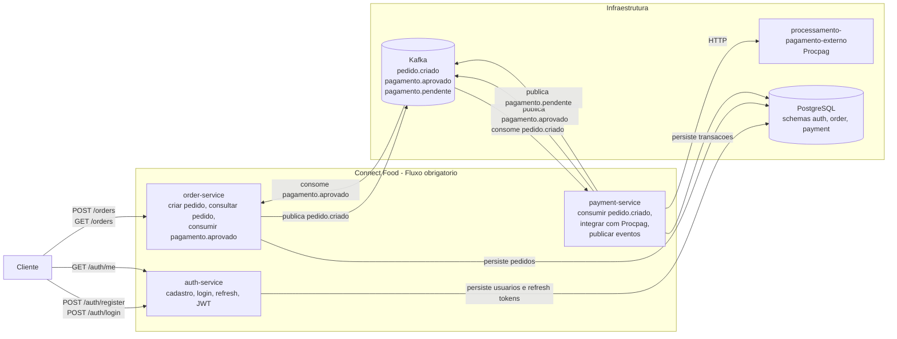

# Arquitetura obrigatoria

Este diagrama representa apenas a arquitetura minima exigida para a entrega e efetivamente presente na aplicacao.

```mermaid
flowchart LR
    cliente[Cliente]

    subgraph Plataforma["Connect Food - Fluxo obrigatorio"]
        auth[auth-service<br/>cadastro, login, refresh, JWT]
        order[order-service<br/>criar pedido, consultar pedido,<br/>consumir pagamento.aprovado]
        payment[payment-service<br/>consumir pedido.criado,<br/>integrar com Procpag,<br/>publicar eventos]
    end

    subgraph Infra["Infraestrutura"]
        postgres[(PostgreSQL<br/>schemas auth, order, payment)]
        kafka[(Kafka<br/>pedido.criado<br/>pagamento.aprovado<br/>pagamento.pendente)]
        procpag[processamento-pagamento-externo<br/>Procpag]
    end

    cliente -->|POST /auth/register<br/>POST /auth/login| auth
    cliente -->|GET /auth/me| auth
    cliente -->|POST /orders<br/>GET /orders| order

    auth -->|persiste usuarios e refresh tokens| postgres
    order -->|persiste pedidos| postgres
    payment -->|persiste transacoes| postgres

    order -->|publica pedido.criado| kafka
    kafka -->|consome pedido.criado| payment
    payment -->|publica pagamento.aprovado| kafka
    payment -->|publica pagamento.pendente| kafka
    kafka -->|consome pagamento.aprovado| order

    payment -->|HTTP| procpag
```
