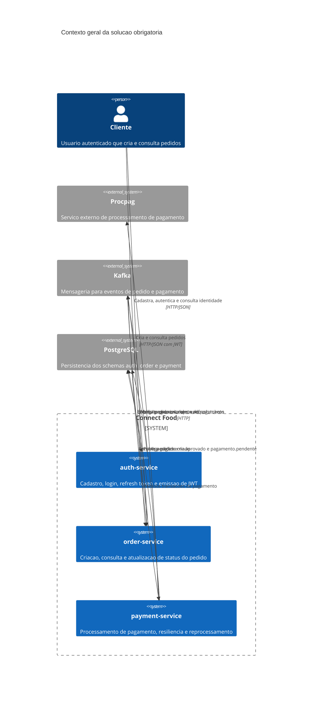

# Diagrama C4

Este diagrama usa a notacao C4 do Mermaid para representar os containers obrigatorios da solucao.

```mermaid
C4Context
    title Contexto geral da solucao obrigatoria

    Person(cliente, "Cliente", "Usuario autenticado que cria e consulta pedidos")

    System_Boundary(connect_food, "Connect Food") {
        System(auth, "auth-service", "Cadastro, login, refresh token e emissao de JWT")
        System(order, "order-service", "Criacao, consulta e atualizacao de status do pedido")
        System(payment, "payment-service", "Processamento de pagamento, resiliencia e reprocessamento")
    }

    System_Ext(procpag, "Procpag", "Servico externo de processamento de pagamento")
    System_Ext(kafka, "Kafka", "Mensageria para eventos de pedido e pagamento")
    System_Ext(postgres, "PostgreSQL", "Persistencia dos schemas auth, order e payment")

    Rel(cliente, auth, "Cadastra, autentica e consulta identidade", "HTTP/JSON")
    Rel(cliente, order, "Cria e consulta pedidos", "HTTP/JSON com JWT")

    Rel(auth, postgres, "Persiste usuarios, roles e refresh tokens")
    Rel(order, postgres, "Persiste pedidos")
    Rel(payment, postgres, "Persiste transacoes de pagamento")

    Rel(order, kafka, "Publica pedido.criado")
    Rel(kafka, payment, "Entrega pedido.criado")
    Rel(payment, kafka, "Publica pagamento.aprovado e pagamento.pendente")
    Rel(kafka, order, "Entrega pagamento.aprovado")
    Rel(payment, procpag, "Solicita processamento do pagamento", "HTTP")
```
