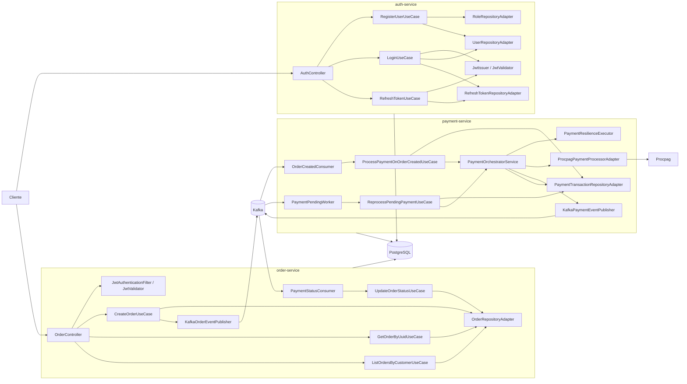

# Diagrama de componentes

Este diagrama detalha os principais componentes internos dos servicos obrigatorios e suas integracoes.

```mermaid
flowchart LR
    cliente[Cliente]
    procpag[Procpag]
    kafka[(Kafka)]
    postgres[(PostgreSQL)]

    subgraph auth["auth-service"]
        authController[AuthController]
        registerUC[RegisterUserUseCase]
        loginUC[LoginUseCase]
        refreshUC[RefreshTokenUseCase]
        jwtIssuer[JwtIssuer / JwtValidator]
        userRepo[UserRepositoryAdapter]
        roleRepo[RoleRepositoryAdapter]
        refreshRepo[RefreshTokenRepositoryAdapter]
    end

    subgraph order["order-service"]
        orderController[OrderController]
        createOrderUC[CreateOrderUseCase]
        getOrderUC[GetOrderByUuidUseCase]
        listOrdersUC[ListOrdersByCustomerUseCase]
        updateStatusUC[UpdateOrderStatusUseCase]
        orderPublisher[KafkaOrderEventPublisher]
        paymentApprovedConsumer[PaymentStatusConsumer]
        orderRepo[OrderRepositoryAdapter]
        orderJwt[JwtAuthenticationFilter / JwtValidator]
    end

    subgraph payment["payment-service"]
        orderCreatedConsumer[OrderCreatedConsumer]
        pendingWorker[PaymentPendingWorker]
        processPaymentUC[ProcessPaymentOnOrderCreatedUseCase]
        reprocessPaymentUC[ReprocessPendingPaymentUseCase]
        orchestrator[PaymentOrchestratorService]
        resilience[PaymentResilienceExecutor]
        processor[ProcpagPaymentProcessorAdapter]
        paymentPublisher[KafkaPaymentEventPublisher]
        paymentRepo[PaymentTransactionRepositoryAdapter]
    end

    cliente --> authController
    cliente --> orderController

    authController --> registerUC
    authController --> loginUC
    authController --> refreshUC
    loginUC --> jwtIssuer
    refreshUC --> jwtIssuer
    registerUC --> roleRepo
    registerUC --> userRepo
    loginUC --> userRepo
    loginUC --> refreshRepo
    refreshUC --> refreshRepo
    auth --> postgres

    orderController --> orderJwt
    orderController --> createOrderUC
    orderController --> getOrderUC
    orderController --> listOrdersUC
    createOrderUC --> orderRepo
    getOrderUC --> orderRepo
    listOrdersUC --> orderRepo
    createOrderUC --> orderPublisher
    paymentApprovedConsumer --> updateStatusUC
    updateStatusUC --> orderRepo
    order --> postgres
    orderPublisher --> kafka
    kafka --> paymentApprovedConsumer

    kafka --> orderCreatedConsumer
    kafka --> pendingWorker
    orderCreatedConsumer --> processPaymentUC
    pendingWorker --> reprocessPaymentUC
    processPaymentUC --> paymentRepo
    reprocessPaymentUC --> paymentRepo
    processPaymentUC --> orchestrator
    reprocessPaymentUC --> orchestrator
    orchestrator --> resilience
    orchestrator --> processor
    orchestrator --> paymentPublisher
    orchestrator --> paymentRepo
    processor --> procpag
    payment --> postgres
    paymentPublisher --> kafka
```
