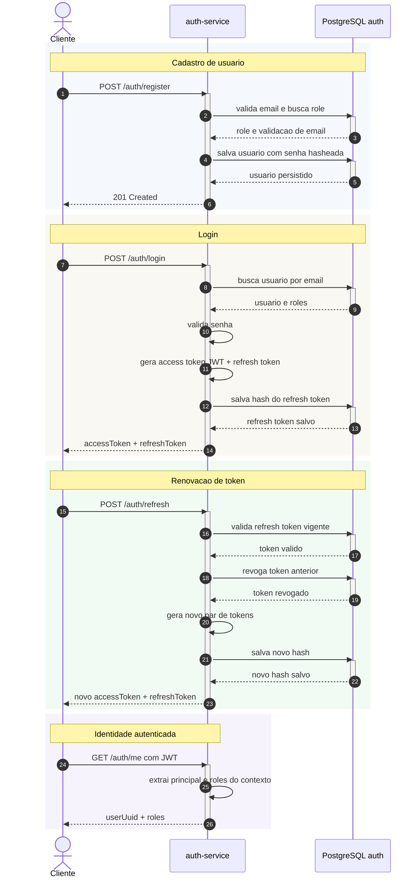

# Fluxo de autenticacao

O servico de autenticacao implementa os fluxos obrigatorios de cadastro, login, refresh token e identificacao do usuario autenticado.

```mermaid
sequenceDiagram
    autonumber
    actor Cliente
    participant Auth as auth-service
    participant AuthDB as PostgreSQL auth

    rect rgb(245, 248, 252)
        Note over Cliente,AuthDB: Cadastro de usuario
        Cliente->>Auth: POST /auth/register
        activate Auth
        Auth->>AuthDB: valida email e busca role
        activate AuthDB
        AuthDB-->>Auth: role e validacao de email
        deactivate AuthDB
        Auth->>AuthDB: salva usuario com senha hasheada
        activate AuthDB
        AuthDB-->>Auth: usuario persistido
        deactivate AuthDB
        Auth-->>Cliente: 201 Created
        deactivate Auth
    end

    rect rgb(250, 248, 242)
        Note over Cliente,AuthDB: Login
        Cliente->>Auth: POST /auth/login
        activate Auth
        Auth->>AuthDB: busca usuario por email
        activate AuthDB
        AuthDB-->>Auth: usuario e roles
        deactivate AuthDB
        Auth->>Auth: valida senha
        Auth->>Auth: gera access token JWT + refresh token
        Auth->>AuthDB: salva hash do refresh token
        activate AuthDB
        AuthDB-->>Auth: refresh token salvo
        deactivate AuthDB
        Auth-->>Cliente: accessToken + refreshToken
        deactivate Auth
    end

    rect rgb(242, 250, 244)
        Note over Cliente,AuthDB: Renovacao de token
        Cliente->>Auth: POST /auth/refresh
        activate Auth
        Auth->>AuthDB: valida refresh token vigente
        activate AuthDB
        AuthDB-->>Auth: token valido
        deactivate AuthDB
        Auth->>AuthDB: revoga token anterior
        activate AuthDB
        AuthDB-->>Auth: token revogado
        deactivate AuthDB
        Auth->>Auth: gera novo par de tokens
        Auth->>AuthDB: salva novo hash
        activate AuthDB
        AuthDB-->>Auth: novo hash salvo
        deactivate AuthDB
        Auth-->>Cliente: novo accessToken + refreshToken
        deactivate Auth
    end

    rect rgb(247, 243, 252)
        Note over Cliente,Auth: Identidade autenticada
        Cliente->>Auth: GET /auth/me com JWT
        activate Auth
        Auth->>Auth: extrai principal e roles do contexto
        Auth-->>Cliente: userUuid + roles
        deactivate Auth
    end
```
