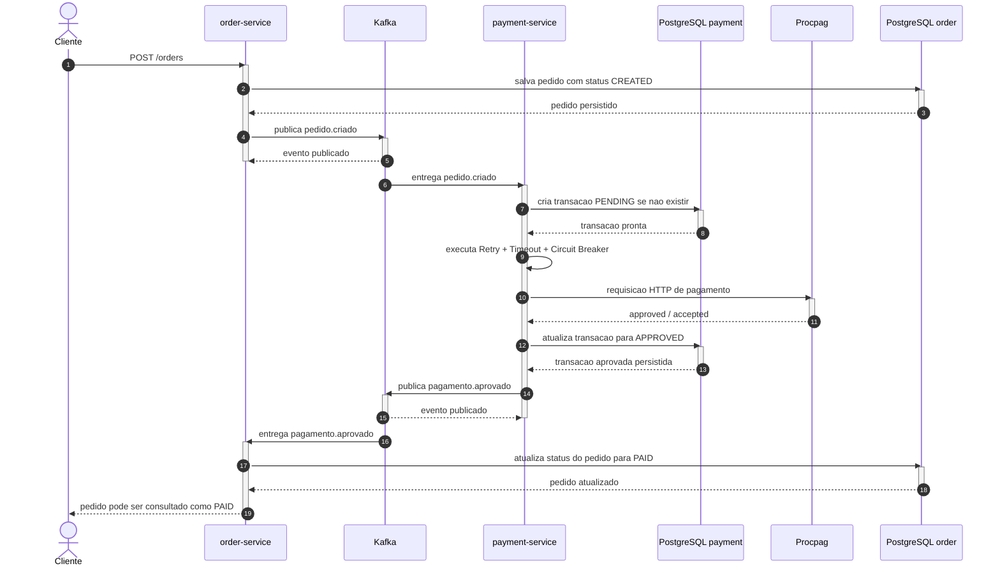

# Fluxo de pagamento aprovado

Este e o fluxo principal da aplicacao: pedido criado, pagamento processado e pedido atualizado automaticamente para `PAID`.

```mermaid
sequenceDiagram
    autonumber
    actor Cliente
    participant Order as order-service
    participant Kafka as Kafka
    participant Payment as payment-service
    participant PayDB as PostgreSQL payment
    participant Procpag as Procpag
    participant OrderDB as PostgreSQL order

    Cliente->>Order: POST /orders
    activate Order
    Order->>OrderDB: salva pedido com status CREATED
    activate OrderDB
    OrderDB-->>Order: pedido persistido
    deactivate OrderDB
    Order->>Kafka: publica pedido.criado
    activate Kafka
    Kafka-->>Order: evento publicado
    deactivate Kafka
    deactivate Order

    Kafka->>Payment: entrega pedido.criado
    activate Payment
    Payment->>PayDB: cria transacao PENDING se nao existir
    activate PayDB
    PayDB-->>Payment: transacao pronta
    deactivate PayDB
    Payment->>Payment: executa Retry + Timeout + Circuit Breaker
    Payment->>Procpag: requisicao HTTP de pagamento
    activate Procpag
    Procpag-->>Payment: approved / accepted
    deactivate Procpag
    Payment->>PayDB: atualiza transacao para APPROVED
    activate PayDB
    PayDB-->>Payment: transacao aprovada persistida
    deactivate PayDB
    Payment->>Kafka: publica pagamento.aprovado
    activate Kafka
    Kafka-->>Payment: evento publicado
    deactivate Kafka
    deactivate Payment

    Kafka->>Order: entrega pagamento.aprovado
    activate Order
    Order->>OrderDB: atualiza status do pedido para PAID
    activate OrderDB
    OrderDB-->>Order: pedido atualizado
    deactivate OrderDB
    Order-->>Cliente: pedido pode ser consultado como PAID
    deactivate Order
```
