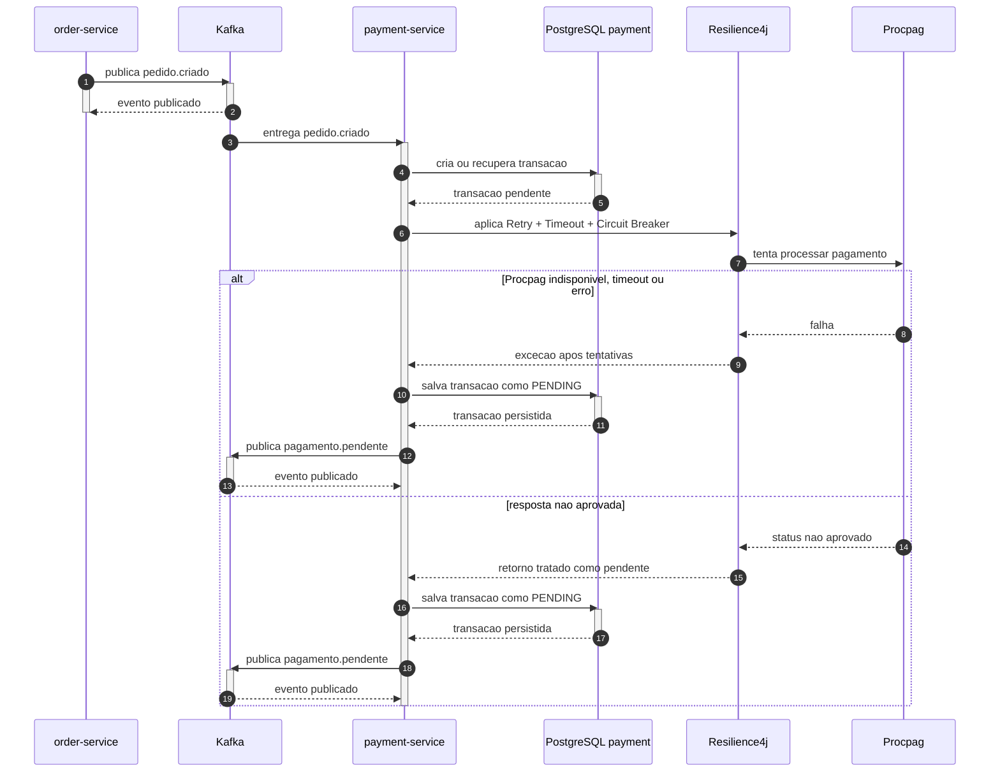

# Fluxo de pagamento pendente

Este diagrama mostra o comportamento de resiliencia implementado quando a integracao com a Procpag falha, expira ou retorna status nao aprovado.

Observacao: no codigo atual, o evento `pagamento.pendente` e tratado no `payment-service` para reprocessamento. O `order-service` implementado consome apenas `pagamento.aprovado`.

