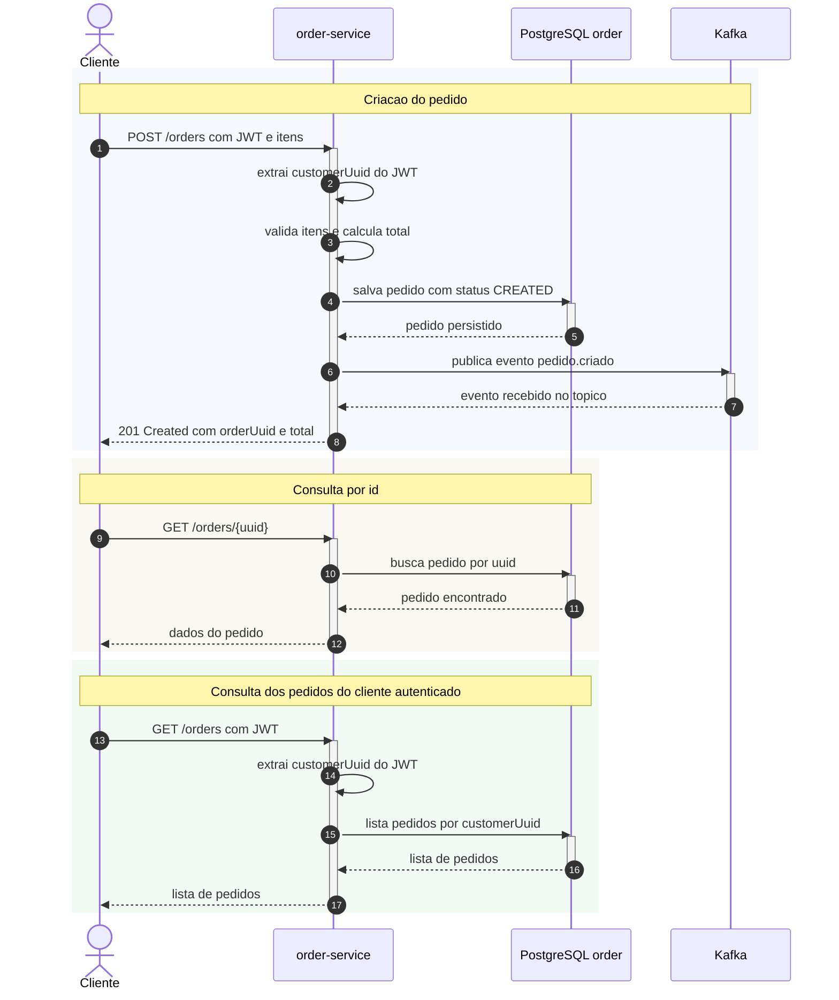

# Fluxo de criacao e consulta de pedidos

Este arquivo cobre os fluxos obrigatorios implementados no `order-service`: criacao do pedido e consultas por identificador e por cliente autenticado.

```mermaid
sequenceDiagram
    autonumber
    actor Cliente
    participant Order as order-service
    participant OrderDB as PostgreSQL order
    participant Kafka as Kafka

    rect rgb(245, 248, 252)
        Note over Cliente,Kafka: Criacao do pedido
        Cliente->>Order: POST /orders com JWT e itens
        activate Order
        Order->>Order: extrai customerUuid do JWT
        Order->>Order: valida itens e calcula total
        Order->>OrderDB: salva pedido com status CREATED
        activate OrderDB
        OrderDB-->>Order: pedido persistido
        deactivate OrderDB
        Order->>Kafka: publica evento pedido.criado
        activate Kafka
        Kafka-->>Order: evento recebido no topico
        deactivate Kafka
        Order-->>Cliente: 201 Created com orderUuid e total
        deactivate Order
    end

    rect rgb(250, 248, 242)
        Note over Cliente,OrderDB: Consulta por id
        Cliente->>Order: GET /orders/{uuid}
        activate Order
        Order->>OrderDB: busca pedido por uuid
        activate OrderDB
        OrderDB-->>Order: pedido encontrado
        deactivate OrderDB
        Order-->>Cliente: dados do pedido
        deactivate Order
    end

    rect rgb(242, 250, 244)
        Note over Cliente,OrderDB: Consulta dos pedidos do cliente autenticado
        Cliente->>Order: GET /orders com JWT
        activate Order
        Order->>Order: extrai customerUuid do JWT
        Order->>OrderDB: lista pedidos por customerUuid
        activate OrderDB
        OrderDB-->>Order: lista de pedidos
        deactivate OrderDB
        Order-->>Cliente: lista de pedidos
        deactivate Order
    end
```
