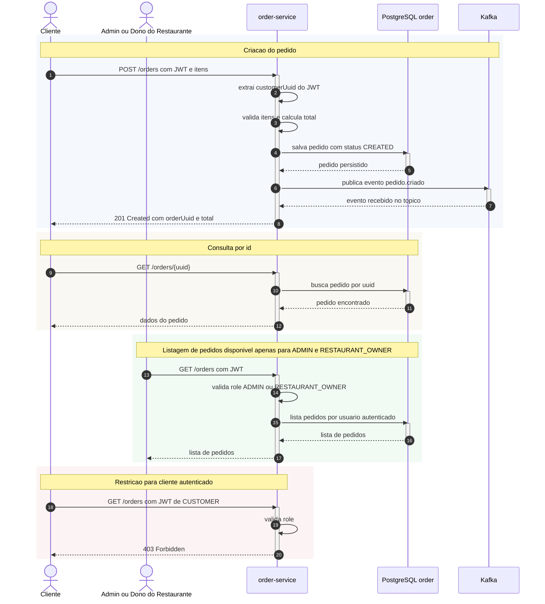

# Fluxo de criacao e consulta de pedidos

Este arquivo cobre os fluxos obrigatorios implementados no `order-service`: criacao do pedido, consulta por identificador e listagem restrita a `ADMIN` e `RESTAURANT_OWNER`.

