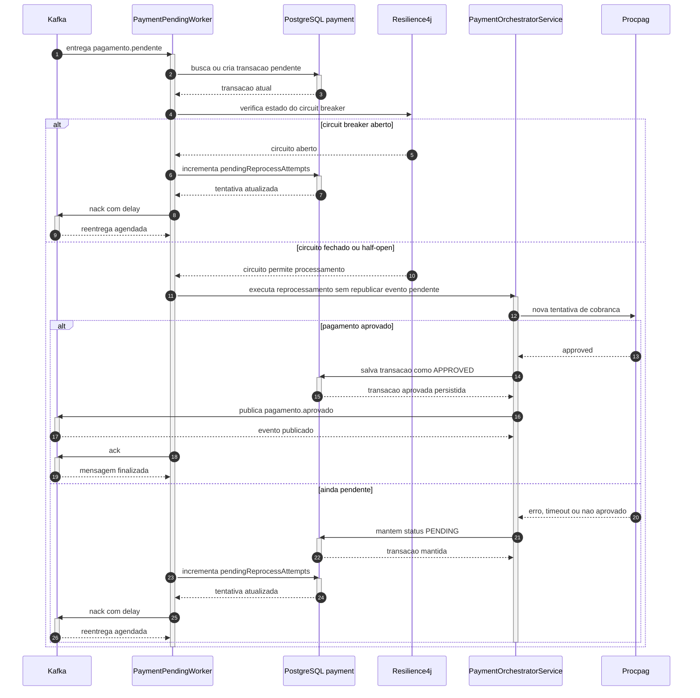

# Fluxo de reprocessamento de pagamento

O `payment-service` possui um worker dedicado para reprocessar mensagens `pagamento.pendente` ate aprovacao ou ate atingir o limite de tentativas configurado.

