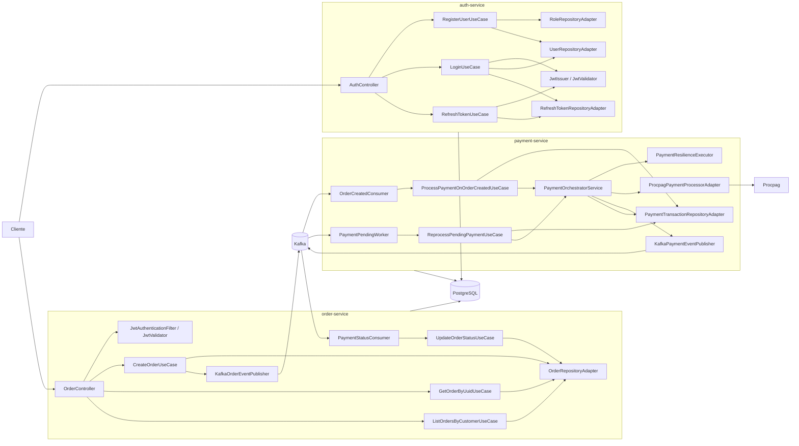
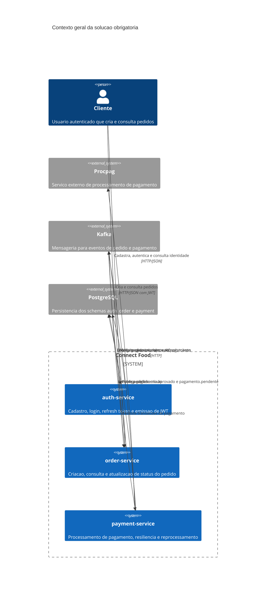
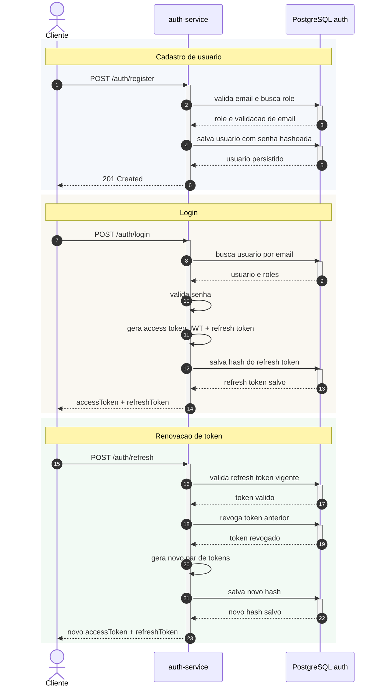
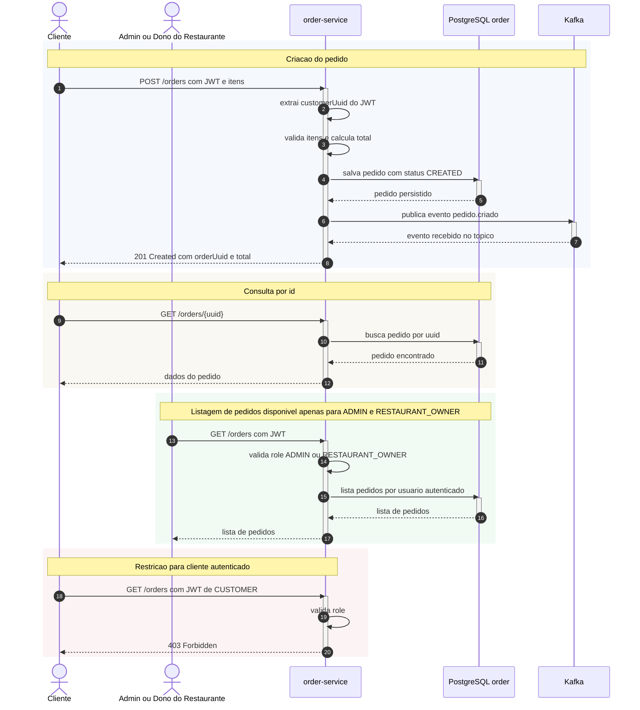
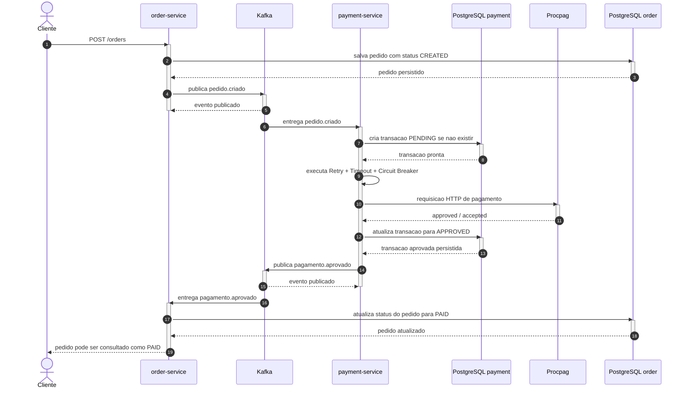
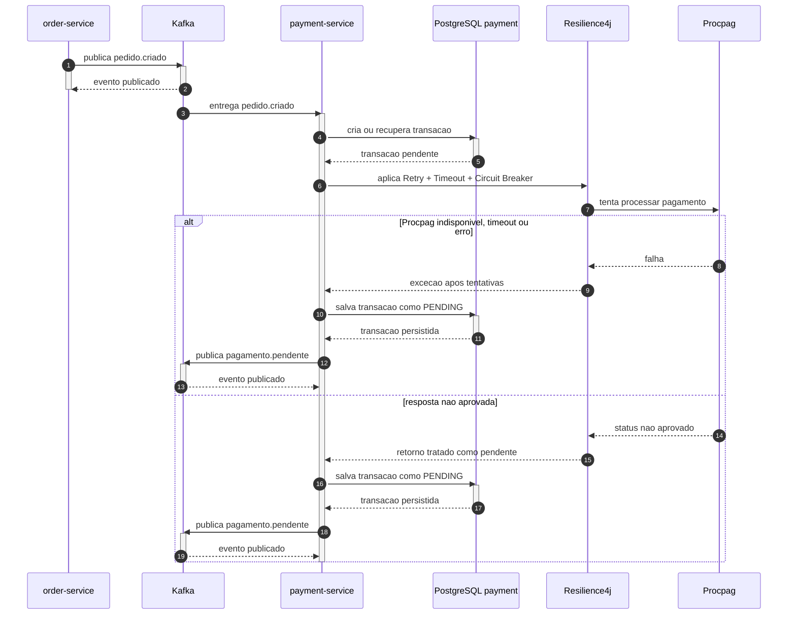
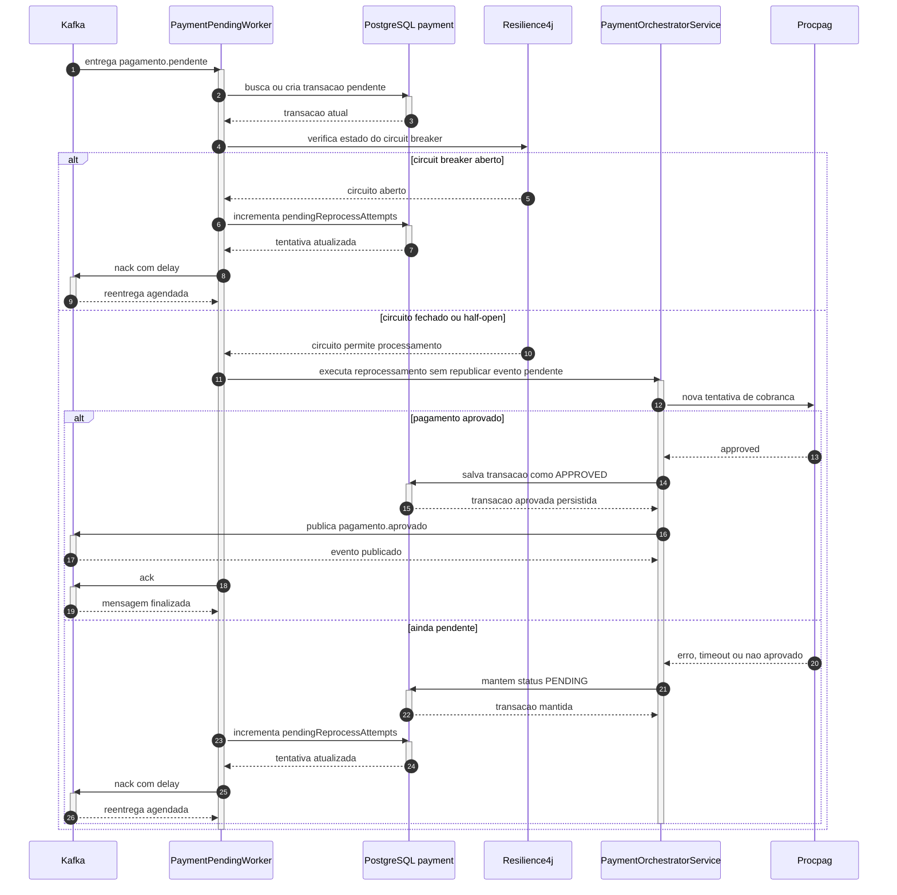

# Connect Food - Tech Challenge Fase 3

**Projeto:** Connect Food - Sistema de Pedido Online para Restaurante  
**Equipe:** _preencher com nomes e RMs da equipe_  
**Disciplina:** Tech Challenge - Fase 3  
**Base documental:** `docs/tc-3.md`  
**Escopo considerado neste documento:** apenas os fluxos obrigatorios da entrega (`auth-service`, `order-service` e `payment-service`)

---

## 1. Introducao

O presente documento tem como finalidade apresentar, de forma academica e estruturada, a documentacao tecnica da entrega da Fase 3 do Tech Challenge. O problema proposto consiste na implementacao de um sistema distribuido para pedidos online em restaurante, contemplando autenticacao de usuarios, criacao e consulta de pedidos, integracao com um servico externo de pagamento e mecanismos de resiliencia para tratamento de falhas.

Diferentemente de uma aplicacao monolitica tradicional, a proposta desta fase exige a divisao do problema em servicos independentes, com responsabilidades bem definidas e integrados por eventos assicronos. Nesse contexto, a solucao desenvolvida busca atender simultaneamente aos requisitos funcionais e nao funcionais descritos em `docs/tc-3.md`, com especial enfase nos seguintes pontos:

- autenticacao baseada em JWT;
- arquitetura orientada a servicos;
- mensageria com Kafka;
- persistencia relacional com PostgreSQL;
- resiliencia com Retry, Timeout e Circuit Breaker;
- reprocessamento automatico de pagamentos pendentes.

Este relatorio considera somente os elementos obrigatorios da avaliacao. Os modulos opcionais `restaurant-service` e `api-gateway` nao sao detalhados aqui, em conformidade com a orientacao da entrega.

## 2. Visao Geral

O sistema Connect Food foi concebido para representar uma base distribuida e evolutiva para operacao de pedidos online. A ideia central da solucao e desacoplar os principais contextos de negocio em componentes especializados, reduzindo dependencias diretas, melhorando a escalabilidade e favorecendo a manutencao.

Na implementacao atual, o sistema esta organizado em tres servicos obrigatorios:

- `auth-service`, responsavel pela gestao de identidade, emissoes de token e renovacao de sessao;
- `order-service`, responsavel pelo cadastro e consulta de pedidos;
- `payment-service`, responsavel pelo processamento de pagamento, tratamento de indisponibilidade da integracao externa e reprocessamento de pendencias.

Essa separacao reflete uma estrategia arquitetural coerente com sistemas modernos orientados a dominio e eventos. O `order-service` concentra o contexto de pedido, enquanto o `payment-service` encapsula o contexto de pagamento e toda a complexidade relacionada a falhas de integracao externa. O `auth-service`, por sua vez, atua como o servico central de autenticacao e emissao de JWT para os endpoints protegidos.

Em termos de experiencia de uso, o fluxo principal ocorre da seguinte forma:

1. o cliente realiza cadastro e autenticacao;
2. de posse do JWT, cria um pedido;
3. o pedido e persistido e publicado no Kafka;
4. o `payment-service` consome o evento e realiza a tentativa de cobranca;
5. se aprovado, o pagamento gera um evento de confirmacao;
6. o `order-service` consome esse evento e atualiza o pedido para `PAID`;
7. se houver falha externa, o pagamento permanece pendente e entra em fluxo automatico de reprocessamento.

## 3. Arquitetura do Sistema

### 3.1 Fundamentacao arquitetural

A estrutura do projeto segue os principios da Clean Architecture e da Hexagonal Architecture, conforme recomendado no enunciado da fase. Na pratica, isso significa que a regra de negocio central foi mantida separada dos detalhes de infraestrutura, tais como controladores REST, adaptadores de persistencia, configuracoes de mensageria e integracoes com sistemas externos.

Essa decisao traz beneficios relevantes para um projeto academico e profissional:

- maior clareza estrutural;
- separacao explicita de responsabilidades;
- facilidade de testes unitarios e de integracao;
- menor acoplamento entre regra de negocio e framework;
- maior capacidade de evolucao da solucao para fases futuras.

### 3.2 Estrutura em camadas

Os servicos estao organizados, de forma geral, nas seguintes camadas:

#### 3.2.1 Domain

E a camada central da aplicacao. Nela estao:

- entidades de dominio;
- enumeracoes de estado;
- excecoes de negocio;
- portas de entrada e saida.

Essa camada nao deve depender de tecnologias externas, preservando a independencia do nucleo de negocio.

#### 3.2.2 Application

E a camada responsavel por orquestrar os casos de uso do sistema. Nela estao:

- use cases;
- services de orquestracao;
- DTOs de entrada e saida da aplicacao;
- regras transacionais e coordenacao de chamadas entre dominio e adaptadores.

#### 3.2.3 Infrastructure

Essa camada implementa os detalhes tecnicos. Nela estao:

- controllers REST;
- adaptadores JPA;
- configuracoes do Spring;
- integracoes Kafka;
- filtros e validadores de seguranca;
- adaptador HTTP para a Procpag.

### 3.3 Arquitetura obrigatoria da solucao

O diagrama a seguir apresenta a visao arquitetural apenas com os servicos obrigatorios considerados nesta entrega.

```mermaid
flowchart LR
    cliente[Cliente]

    subgraph Plataforma["Connect Food - Fluxo obrigatorio"]
        auth[auth-service<br/>cadastro, login, refresh, JWT]
        order[order-service<br/>criar pedido, consultar por id,<br/>listar pedidos para admin/dono,<br/>consumir pagamento.aprovado]
        payment[payment-service<br/>consumir pedido.criado,<br/>integrar com Procpag,<br/>publicar eventos]
    end

    subgraph Infra["Infraestrutura"]
        postgres[(PostgreSQL<br/>schemas auth, order, payment)]
        kafka[(Kafka<br/>pedido.criado<br/>pagamento.aprovado<br/>pagamento.pendente)]
        procpag[processamento-pagamento-externo<br/>Procpag]
    end

    cliente -->|POST /auth/register<br/>POST /auth/login| auth
    cliente -->|GET /auth/me| auth
    cliente -->|POST /orders<br/>GET /orders/{uuid}| order
    cliente -->|GET /orders<br/>somente ADMIN/RESTAURANT_OWNER| order

    auth -->|persiste usuarios e refresh tokens| postgres
    order -->|persiste pedidos| postgres
    payment -->|persiste transacoes| postgres

    order -->|publica pedido.criado| kafka
    kafka -->|consome pedido.criado| payment
    payment -->|publica pagamento.aprovado| kafka
    payment -->|publica pagamento.pendente| kafka
    kafka -->|consome pagamento.aprovado| order

    payment -->|HTTP| procpag
```

### 3.4 Diagrama de componentes



### 3.5 Visao C4



## 4. Tecnologias Utilizadas

O projeto foi desenvolvido em **Java 21**, utilizando **Spring Boot 4.0.2** como base para os servicos. Para persistencia foi adotado **PostgreSQL**, com **Spring Data JPA** como tecnologia ORM e **Flyway** para versionamento e criacao controlada do banco de dados.

No contexto de seguranca, foi utilizada a combinacao de **Spring Security** com **JWT**, por meio da biblioteca `jjwt`, permitindo autenticacao stateless e propagacao de identidade do usuario entre as requisicoes. Para documentacao das APIs REST, o projeto utiliza **Springdoc OpenAPI**.

Para comunicacao assicrona entre servicos foi adotado **Apache Kafka**, integrado via **Spring Kafka**. Ja para a integracao HTTP com o servico externo de pagamento, foi utilizado **Spring Cloud OpenFeign**. Os mecanismos de tratamento de falhas foram implementados com **Resilience4j**, contemplando os padroes exigidos pelo enunciado.

No aspecto operacional e de entrega, a solucao utiliza **Docker** e **Docker Compose** para orquestracao local dos servicos, enquanto o **Maven** foi adotado como ferramenta de build e gerenciamento de dependencias.

### 4.1 Resumo da stack

| Tecnologia | Uso no projeto |
| --- | --- |
| Java 21 | Linguagem principal |
| Spring Boot 4.0.2 | Base dos servicos |
| Spring Web MVC | Exposicao das APIs HTTP |
| Spring Security | Controle de acesso |
| JWT (`jjwt`) | Emissao e validacao de tokens |
| Spring Data JPA | Persistencia |
| PostgreSQL | Banco de dados |
| Flyway | Migracoes e versionamento do banco |
| Apache Kafka | Integracao por eventos |
| Spring Kafka | Producer e consumer |
| Spring Cloud OpenFeign | Cliente HTTP para Procpag |
| Resilience4j | Retry, Timeout e Circuit Breaker |
| Springdoc OpenAPI | Swagger/OpenAPI |
| Lombok | Reducao de boilerplate |
| Docker / Compose | Execucao local conteinerizada |
| Maven | Build e dependencias |

## 5. Modelagem de Dominio e Banco de Dados

O modelo de dominio foi definido a partir dos requisitos funcionais e nao funcionais presentes no `tc-3.md`. O sistema foi particionado em tres contextos principais: autenticacao, pedidos e pagamentos.

### 5.1 Contexto de autenticacao

O schema `auth` concentra a estrutura de identidade e acesso. As principais tabelas identificadas nas migracoes sao:

- `roles`: armazena os papeis de acesso;
- `users`: armazena os usuarios da plataforma;
- `user_roles`: representa a associacao entre usuarios e papeis;
- `refresh_tokens`: armazena o hash dos refresh tokens, sua validade e eventual revogacao.

Papeis semeados na base:

- `ADMIN`
- `CUSTOMER`
- `RESTAURANT_OWNER`

Do ponto de vista de dominio, o servico trabalha principalmente com:

- `User`
- `Role`

A principal responsabilidade desse contexto e autenticar o usuario, emitir tokens e preservar a rastreabilidade da sessao por meio do refresh token.

### 5.2 Contexto de pedidos

O schema `order` representa o agregado de pedido. As tabelas principais sao:

- `orders`
- `order_items`

A entidade `Order` encapsula:

- `uuid` do pedido;
- `customerUuid` do usuario autenticado;
- `restaurantId`;
- `status`;
- `totalAmount`;
- lista de itens.

Cada item do pedido contem:

- identificador do item;
- nome;
- quantidade;
- preco unitario.

O status do pedido e expresso pelo enum `OrderStatus`, com os seguintes valores:

- `CREATED`
- `PENDING_PAYMENT`
- `PAID`
- `CANCELLED`

### 5.3 Contexto de pagamentos

O schema `payment` possui como estrutura principal a tabela `payment_transaction`, responsavel por registrar a tentativa de pagamento associada a cada pedido.

Campos relevantes:

- `uuid`
- `order_uuid`
- `customer_uuid`
- `status`
- `amount`
- `pending_reprocess_attempts`

O status do pagamento e expresso pelo enum `PaymentStatus`, com os valores:

- `APPROVED`
- `PENDING`
- `FAILED`

Esse contexto concentra a resiliencia operacional da solucao, uma vez que lida com indisponibilidade de servico externo e reprocessamento automatico.

### 5.4 Consideracoes sobre a modelagem

Em todos os servicos, observa-se a existencia de separacao entre:

- modelo de dominio;
- entidades de persistencia;
- adaptadores de repositorio;
- mapeadores entre dominio e infraestrutura.

Essa separacao reforca a aderencia do projeto a uma abordagem arquitetural limpa, reduzindo o acoplamento entre o nucleo do dominio e os detalhes de banco de dados.

## 6. Casos de Uso e Fluxos Principais

Esta secao apresenta os principais casos de uso implementados e os respectivos fluxos de execucao. Alem da descricao textual, os diagramas foram incorporados diretamente no documento para renderizacao.

### 6.1 Cadastro, login e renovacao de sessao

No `auth-service`, os casos de uso `RegisterUserUseCase`, `LoginUseCase` e `RefreshTokenUseCase` sao responsaveis por:

- cadastrar usuarios com senha hasheada;
- validar credenciais;
- emitir access token e refresh token;
- revogar refresh token anterior;
- gerar novo par de tokens quando necessario.

Fluxo academico resumido:

1. o cliente envia a requisicao para cadastro ou autenticacao;
2. o controller converte o request em DTO de aplicacao;
3. o caso de uso executa as validacoes necessarias;
4. o adaptador de persistencia interage com o banco;
5. o servico retorna resposta padronizada ao consumidor.



### 6.2 Criacao e consulta de pedidos

O `order-service` implementa os seguintes casos de uso principais:

- `CreateOrderUseCase`
- `GetOrderByUuidUseCase`
- `ListOrdersByCustomerUseCase`
- `UpdateOrderStatusUseCase`

No fluxo de criacao, o sistema extrai o identificador do cliente a partir do JWT, valida a lista de itens, calcula o valor total, persiste o pedido e publica o evento `pedido.criado`. Nas consultas, o pedido pode ser recuperado individualmente por qualquer usuario autenticado, enquanto a listagem `GET /orders` fica restrita a usuarios com papel `ADMIN` ou `RESTAURANT_OWNER`.



### 6.3 Fluxo principal de pagamento aprovado

O caso de uso `ProcessPaymentOnOrderCreatedUseCase`, em conjunto com `PaymentOrchestratorService`, e responsavel por tratar o evento `pedido.criado`, persistir a transacao de pagamento, executar a chamada para a Procpag e, em caso de sucesso, publicar `pagamento.aprovado`.



### 6.4 Fluxo de pagamento pendente

Quando a integracao com a Procpag falha, expira ou retorna um status nao aprovado, o sistema nao derruba o processamento como erro terminal. Em vez disso, registra a transacao como pendente e publica um evento proprio para reprocessamento.



### 6.5 Reprocessamento automatico de pagamento

O worker `PaymentPendingWorker` executa o reprocessamento de transacoes pendentes. Esse processo considera o estado do circuit breaker e controla o numero de tentativas por meio do campo `pending_reprocess_attempts`.



## 7. Endpoints da API

Os endpoints implementados para os fluxos obrigatorios estao concentrados nos servicos `auth-service` e `order-service`. O `payment-service`, na implementacao atual, atua principalmente por eventos e integracao HTTP com a Procpag, nao expondo endpoints REST de negocio centrais para o fluxo principal.

### 7.1 Endpoints do auth-service

| Metodo | Endpoint | Finalidade | Requer JWT |
| --- | --- | --- | --- |
| POST | `/auth/register` | Cadastrar usuario | Nao |
| POST | `/auth/login` | Autenticar usuario e emitir tokens | Nao |
| POST | `/auth/refresh` | Renovar sessao com refresh token | Nao |
| GET | `/auth/me` | Retornar dados do usuario autenticado | Sim |

### 7.2 Endpoints do order-service

| Metodo | Endpoint | Finalidade | Requer JWT |
| --- | --- | --- | --- |
| POST | `/orders` | Criar pedido | Sim |
| GET | `/orders/{uuid}` | Consultar pedido por identificador | Sim |
| GET | `/orders` | Listar pedidos do usuario autenticado, restrito a `ADMIN` e `RESTAURANT_OWNER` | Sim |

### 7.3 Observacoes de documentacao OpenAPI

Os servicos HTTP utilizam Springdoc OpenAPI, permitindo a geracao de documentacao Swagger/OpenAPI. No `auth-service`, por exemplo, estao configurados os caminhos:

- `/v3/api-docs`
- `/swagger-ui`

Essa capacidade favorece demonstracao academica, exploracao manual da API e validacao funcional durante a apresentacao.

## 8. Padroes de Resposta e Tratamentos de Erros

### 8.1 Respostas de sucesso

As respostas de sucesso seguem o padrao esperado de uma API REST:

- `201 Created` para criacao de recursos, como cadastro de usuario e criacao de pedido;
- `200 OK` para autenticacao, renovacao de token e consultas.

Exemplos de respostas:

#### 8.1.1 Login

```json
{
  "accessToken": "jwt-token",
  "refreshToken": "refresh-token",
  "expiresInSeconds": 900
}
```

#### 8.1.2 Consulta de autenticacao

```json
{
  "userUuid": "uuid-do-usuario",
  "roles": ["CUSTOMER"]
}
```

### 8.2 Tratamento de erros no auth-service

O `auth-service` utiliza um modelo proprio de erro inspirado em Problem Details. Os campos identificados no DTO sao:

- `type`
- `title`
- `status`
- `detail`
- `instance`
- `errors`

Status tratados pelo `GlobalExceptionHandler`:

- `400 Bad Request`
- `401 Unauthorized`
- `403 Forbidden`
- `404 Not Found`
- `409 Conflict`
- `500 Internal Server Error`

Exemplo:

```json
{
  "type": "https://httpstatuses.com/400",
  "title": "Bad Request",
  "status": 400,
  "detail": "Invalid input data",
  "instance": "/auth/register",
  "errors": [
    {
      "field": "email",
      "message": "must be a well-formed email address"
    }
  ]
}
```

### 8.3 Tratamento de erros no order-service

O `order-service` utiliza `ProblemDetail`, com aderencia ao estilo RFC 7807, enriquecido com propriedades adicionais.

Campos identificados:

- `type`
- `title`
- `detail`
- `instance`
- `timestamp`
- `errors` para validacao

Status tratados:

- `400 Bad Request`
- `401 Unauthorized`
- `403 Forbidden`
- `404 Not Found`
- `500 Internal Server Error`

Exemplo conceitual:

```json
{
  "type": "https://connectfood.com/problems/validation-error",
  "title": "Validation Error",
  "status": 400,
  "detail": "One or more fields are invalid",
  "instance": "/orders",
  "timestamp": "2026-03-17T10:00:00Z",
  "errors": [
    {
      "field": "items",
      "message": "must not be empty"
    }
  ]
}
```

## 9. Collection para Testes

Para apoiar a validação funcional da solução, o repositório disponibiliza a collection Postman [connectfood-fase3-e2e.postman_collection.json](/c:/Users/lucas/OneDrive/Desktop/fiap/tc-3/services/adjt-fase3-connect-food/docs/collection/connectfood-fase3-e2e.postman_collection.json), localizada no diretório `docs/collection`.

Essa collection foi estruturada para que o professor consiga executar os cenários principais do projeto com o menor nível possível de configuração manual. O arquivo concentra os testes integrados dos fluxos obrigatórios do `auth-service` e do `order-service`, cobrindo cadastro, autenticação, autorização por perfil e operações de pedido.

Os cenários contemplados incluem:

- cadastro de usuários com os perfis `CUSTOMER`, `ADMIN` e `RESTAURANT_OWNER`;
- validação de tentativa de cadastro duplicado;
- validação de perfil inválido;
- autenticação dos usuários cadastrados;
- consulta da identidade autenticada por meio do endpoint `/auth/me`;
- renovação de token com `/auth/refresh`;
- criação de pedidos por usuários autenticados;
- validação da restrição do perfil `CUSTOMER` à rota `GET /orders`;
- validação do acesso permitido a `GET /orders` apenas para `ADMIN` e `RESTAURANT_OWNER`;
- consulta de pedidos por UUID conforme o comportamento atualmente implementado no sistema.

### 9.1. Onde a collection está no repositório

O arquivo encontra-se versionado no seguinte caminho:

`/docs/collection/connectfood-fase3-e2e.postman_collection.json`

Esse é o arquivo que deve ser importado diretamente no Postman.

### 9.2. Como a collection foi preparada

A collection utiliza variáveis dinâmicas do Postman para evitar ajustes manuais entre uma execução e outra. Durante a execução:

1. o script de pré-processamento gera e-mails, nomes, senhas e identificadores auxiliares dinâmicos;
2. os requests de cadastro criam usuários únicos;
3. os testes automáticos armazenam UUIDs retornados pela API;
4. os requests de login armazenam os tokens JWT necessários para os próximos passos;
5. os requests de pedidos reutilizam esses UUIDs e tokens automaticamente.

Na prática, isso significa que o professor não precisa editar payloads, copiar UUIDs manualmente ou alterar e-mails antes de repetir o fluxo.

### 9.3. Preparação do ambiente antes dos testes

Antes de utilizar a collection, recomenda-se executar o seguinte procedimento:

1. iniciar a aplicação e garantir que os serviços obrigatórios estejam em funcionamento;
2. verificar se `auth-service` e `order-service` estão acessíveis;
3. abrir o Postman;
4. importar a collection localizada em `docs/collection/connectfood-fase3-e2e.postman_collection.json`;
5. revisar as variáveis `authBaseUrl` e `orderBaseUrl`.

Por padrão, a collection foi preparada com os seguintes endereços:

- `authBaseUrl = http://localhost:8081`
- `orderBaseUrl = http://localhost:8082`

Caso as portas ou URLs estejam diferentes no ambiente da avaliação, basta alterar esses dois valores antes da execução.

### 9.4. Execução manual da collection

Para uma avaliação passo a passo, o professor pode executar a collection manualmente, request por request, seguindo a ordem numérica já definida no arquivo.

O procedimento recomendado é:

1. importar a collection no Postman;
2. ajustar `authBaseUrl` e `orderBaseUrl`, se necessário;
3. abrir a pasta `01 - Cadastro de Usuarios`;
4. executar cada request na ordem apresentada;
5. seguir para a pasta `02 - Autenticacao e Identidade`;
6. continuar sequencialmente até a pasta `05 - Validacao de Permissoes Reais do Codigo`.

#### 9.4.1. Etapa 1: Cadastro de usuários

Na pasta `01 - Cadastro de Usuarios`, devem ser executados os seguintes requests:

1. `01.01 - Cadastrar CUSTOMER`
2. `01.02 - Cadastrar ADMIN`
3. `01.03 - Cadastrar RESTAURANT_OWNER`
4. `01.04 - Validar duplicidade de CUSTOMER`
5. `01.05 - Validar role invalida`

Resultados esperados:

- os três primeiros requests devem retornar sucesso e salvar os UUIDs dos usuários;
- o teste de duplicidade deve retornar erro controlado;
- o teste com papel inválido também deve retornar erro controlado.

Essa etapa comprova o funcionamento do cadastro e da validação das entradas inválidas.

#### 9.4.2. Etapa 2: Autenticação e identidade

Na pasta `02 - Autenticacao e Identidade`, devem ser executados:

1. `02.01 - Login CUSTOMER`
2. `02.02 - Login ADMIN`
3. `02.03 - Login RESTAURANT_OWNER`
4. `02.04 - CUSTOMER consulta /auth/me`
5. `02.05 - Refresh CUSTOMER`

Resultados esperados:

- os logins devem retornar sucesso;
- os tokens devem ser salvos automaticamente para uso nas próximas requisições;
- `/auth/me` deve comprovar a identidade autenticada;
- o `refresh` deve validar a renovação da sessão ou do token conforme o comportamento atual do serviço.

#### 9.4.3. Etapa 3: Validação de acesso

Na pasta `03 - Validacao de Acesso`, devem ser executados:

1. `03.01 - /auth/me sem token`
2. `03.02 - /auth/me com token invalido`
3. `03.03 - CUSTOMER pode criar pedido`
4. `03.04 - CUSTOMER pode consultar pedido por UUID`
5. `03.05 - CUSTOMER nao pode acessar GET /orders`
6. `03.06 - ADMIN pode acessar GET /orders`
7. `03.07 - RESTAURANT_OWNER pode acessar GET /orders`

Resultados esperados:

- requisições sem autenticação ou com token inválido devem ser rejeitadas;
- o perfil `CUSTOMER` deve conseguir criar pedido e consultar pedido por UUID;
- o perfil `CUSTOMER` deve receber `403 Forbidden` ao tentar acessar `GET /orders`;
- os perfis `ADMIN` e `RESTAURANT_OWNER` devem conseguir acessar a listagem de pedidos.

Essa etapa evidencia a principal regra de autorização implementada no `order-service`.

#### 9.4.4. Etapa 4: Fluxo de pedidos

Na pasta `04 - Fluxo de Pedidos`, devem ser executados:

1. `04.01 - ADMIN cria pedido`
2. `04.02 - OWNER cria pedido`
3. `04.03 - CUSTOMER nao pode listar pedidos`
4. `04.04 - ADMIN lista pedidos`
5. `04.05 - RESTAURANT_OWNER lista pedidos`

Resultados esperados:

- `ADMIN` e `RESTAURANT_OWNER` devem conseguir criar pedidos autenticados;
- `CUSTOMER` deve continuar impedido de listar pedidos;
- `ADMIN` e `RESTAURANT_OWNER` devem conseguir listar os pedidos normalmente.

#### 9.4.5. Etapa 5: Validação das permissões reais do código

Na pasta `05 - Validacao de Permissoes Reais do Codigo`, devem ser executados:

1. `05.01 - ADMIN consulta pedido do CUSTOMER por UUID`
2. `05.02 - OWNER consulta pedido do CUSTOMER por UUID`
3. `05.03 - CUSTOMER consulta pedido do ADMIN por UUID`

Resultados esperados:

- os requests devem retornar sucesso;
- a etapa demonstra o comportamento atualmente implementado para `GET /orders/{uuid}`, que permanece acessível para usuários autenticados que conheçam o identificador do pedido.

Esse ponto é relevante na documentação porque diferencia claramente a restrição existente na listagem geral da consulta individual por UUID.

### 9.5. Execução automática da collection

Além da execução manual, a collection pode ser executada de forma automática pelo `Collection Runner` do Postman.

O procedimento recomendado é:

1. abrir o Postman;
2. acessar o recurso `Runner`;
3. selecionar a collection `ConnectFood Fase 3 - E2E`;
4. conferir as variáveis `authBaseUrl` e `orderBaseUrl`;
5. iniciar a execução da collection completa;
6. acompanhar o relatório final de sucesso e falha dos testes.

Durante a execução automática, o Postman continuará:

- gerando dados dinâmicos;
- armazenando UUIDs;
- salvando tokens;
- reutilizando variáveis automaticamente;
- validando códigos de resposta esperados em cada cenário.

Essa abordagem é recomendada quando o objetivo é reproduzir toda a suíte de validação com menor intervenção manual.

### 9.6. Síntese do uso da collection pelo professor

Em termos práticos, o uso da collection pelo avaliador pode ser resumido no seguinte fluxo:

1. subir a aplicação;
2. importar a collection do diretório `docs/collection`;
3. validar `authBaseUrl` e `orderBaseUrl`;
4. executar os requests manualmente na ordem numérica ou rodar tudo pelo `Collection Runner`;
5. observar os testes automáticos embutidos em cada request.

Desse modo, a collection passa a funcionar não apenas como ferramenta de testes, mas também como evidência executável dos fluxos obrigatórios desenvolvidos no projeto.

## 10. Disponibilidade do Kafka UI

Como apoio à análise da comunicação assíncrona da solução, o ambiente também disponibiliza uma interface de visualização do Kafka por meio do `kafka-ui`. Esse recurso permite que o professor acompanhe, de forma visual, os tópicos existentes no ambiente e observe as mensagens produzidas e consumidas durante a execução dos fluxos integrados.

Do ponto de vista acadêmico, essa interface é especialmente útil para demonstrar que a arquitetura orientada a eventos não está apenas descrita na documentação, mas efetivamente operacional durante a execução do projeto.

### 10.1. Finalidade do Kafka UI

O `kafka-ui` pode ser utilizado para:

- visualizar os tópicos configurados no ambiente;
- inspecionar mensagens publicadas nos tópicos;
- acompanhar o fluxo de eventos trocados entre os serviços;
- apoiar a validação dos cenários assíncronos implementados;
- reforçar, durante a apresentação, o comportamento do sistema orientado a mensageria.

### 10.2. Como o professor pode utilizar

Após subir o ambiente da aplicação, o professor pode acessar o `kafka-ui` pela URL configurada no ambiente local ou conteinerizado. A partir dessa interface, recomenda-se o seguinte procedimento:

1. acessar a interface do `kafka-ui`;
2. localizar o cluster Kafka configurado para o projeto;
3. abrir a lista de tópicos disponíveis;
4. selecionar o tópico desejado;
5. visualizar as mensagens produzidas durante a execução dos fluxos de autenticação, pedidos e pagamentos, conforme aplicável.

Essa verificação pode ser feita em paralelo à execução da collection Postman, permitindo associar cada ação disparada pela API aos eventos gerados e processados no ecossistema.

### 10.3. Uso combinado com a collection de testes

Durante a execução da collection disponível em `docs/collection`, o professor pode manter o `kafka-ui` aberto para observar o comportamento assíncrono do sistema. Essa abordagem torna a avaliação mais completa, pois permite verificar simultaneamente:

- a resposta síncrona da API;
- a publicação de eventos nos tópicos Kafka;
- o consumo dessas mensagens pelos serviços envolvidos;
- a coerência entre o fluxo documentado e o comportamento observado na execução real.

O enunciado da fase solicita a disponibilizacao de uma collection de testes de endpoints em ferramentas como Postman, Bruno ou Insomnia. Durante a analise do repositório atual, nao foi identificado arquivo de collection versionado.

Do ponto de vista academico, esta secao e importante porque demonstra a capacidade de reproducao e validacao da entrega. Assim, recomenda-se que a versao final da submissao inclua:

- uma collection Postman ou Bruno;
- um ambiente configurado com as URLs locais dos servicos;
- scripts ou variaveis para JWT e identificadores;
- cenarios de teste cobrindo:
  - cadastro de usuario;
  - login;
  - refresh token;
  - criacao de pedido;
  - consulta de pedido por UUID;
  - listagem de pedidos para `ADMIN` e `RESTAURANT_OWNER`;
  - validacao de bloqueio do `CUSTOMER` na rota `GET /orders`.

Caso a equipe deseje, essa collection pode ser adicionada em iteracao posterior ao repositorio e referenciada diretamente nesta secao.

## 10. Repositorio do Codigo

O repositório Git configurado no workspace analisado aponta para o seguinte remoto:

`git@github.com:connectFood/adjt-fase3-connect-food.git`

O `README.md` do projeto indica que a equipe deve trabalhar a partir de um fork desse repositorio base. Portanto, para a entrega final, recomenda-se substituir essa referencia pelo link efetivamente pertencente ao repositorio da equipe, caso exista um repositório derivado.

Em termos de conteudo, o repositorio contem:

- codigo-fonte dos servicos;
- `compose.yml` para subida da infraestrutura;
- arquivos Dockerfile por servico;
- scripts de migracao Flyway;
- documentacao de apoio em `docs`;
- diagramas Mermaid elaborados para esta fase.

## 11. Consideracoes Finais

Com base na especificacao de `docs/tc-3.md` e na implementacao existente, conclui-se que a solucao proposta apresenta uma estrutura coerente com os objetivos da Fase 3 do Tech Challenge. O projeto demonstra:

- separacao clara de responsabilidades em servicos independentes;
- uso adequado de autenticacao baseada em JWT;
- implementacao de criacao e consulta de pedidos;
- integracao assicrona entre pedido e pagamento;
- uso de mecanismos de resiliencia frente a falhas externas;
- reprocessamento de pagamentos pendentes de forma automatizada.

Do ponto de vista academico, a entrega evidencia dominio de conceitos relevantes de engenharia de software moderna, tais como arquitetura limpa, mensageria orientada a eventos, seguranca em APIs REST e tolerancia a falhas em sistemas distribuidos.

Como oportunidades de consolidacao da entrega, destacam-se:

- adicionar a collection de testes requisitada no enunciado;
- complementar a documentacao com dados formais da equipe;
- revisar o roteiro de apresentacao para demonstrar os fluxos principais em execucao;
- avaliar, em futura evolucao, a extensao do tratamento de `PENDENTE_PAGAMENTO` tambem no contexto de pedido, caso seja desejado maior alinhamento semantico entre pedido e pagamento.

Em sintese, o Connect Food, na forma implementada para esta fase, constitui uma base tecnica consistente, escalavel e aderente aos requisitos centrais do desafio proposto.
